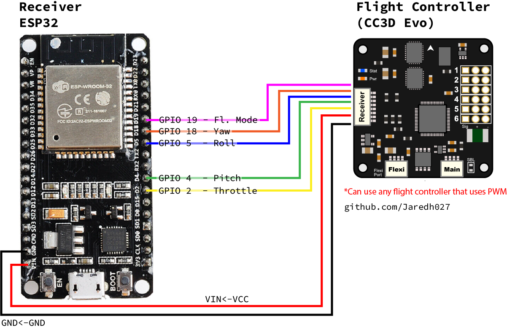

# Drone-Hands

Control a drone using hand movements as the controller. This project allows you to translate natural hand gestures into drone control signals, creating an intuitive flying experience.

## Overview

Traditional drone control systems consist of three main components:
1. Transmitter (controller)
2. Receiver (translates transmitter data for the flight controller)
3. Flight Controller (processes receiver data and stabilizes drone)

This project replaces the traditional transmitter with hand movements, using gyroscope/accelerometer sensors to track hand positioning.

### Control Mapping

| Control Function | Hand | Movement Type |
|-----------------|------|---------------|
| Throttle | Left Hand | Tilt (up/down) |
| Yaw | Left Hand | Rotation |
| Pitch | Right Hand | Tilt (up/down) |
| Roll | Right Hand | Rotation |

## Required Hardware

- 2× ESP32 microcontrollers
- 2× MPU-6050 (gyroscope/accelerometer)
- 1× Drone/vehicle to control
- USB cable for programming

## Required Software

- Arduino IDE (for ESP32 programming)
- LibrePilot (for flight controller calibration)

## Setup Instructions

### 1. Arduino IDE Configuration

1. Open Arduino IDE preferences
2. Add ESP32 board manager URL:
   ```
   https://dl.espressif.com/dl/package_esp32_index.json
   ```
3. Install ESP32 board package:
   - Open Boards Manager
   - Search for "esp32 by Espressif" (version 3.1.0 recommended)
   - Click Install

### 2. ESP32 Programming

#### Receiver Setup
1. Connect first ESP32 to computer
2. Select "DOIT ESP32 DEVKIT V1" as board type
3. Upload receiver code from repository
4. Open Serial Monitor to obtain MAC address (will look like this: ```C8:2E:12:21:BC:24```)
5. Save MAC address for transmitter configuration

#### Transmitter Setup
1. Connect second ESP32 to computer
2. Update MAC address in transmitter code:
   ```
   uint8_t droneMAC[] = {0xC8, 0x2E, 0x12, 0x21, 0xBC, 0x24}; // Replace with your receiver's MAC
   ```
3. Upload transmitter code

### 3. Hardware Assembly

#### Transmitter Wiring


#### Receiver Wiring


### 4. Flight Controller Configuration

1. Connect flight controller to computer
2. Open LibrePilot
3. Update firmware if necessary
4. Calibrate motors
5. Verify receiver activity:
   - Check "Receiver Activity" indicator in Configuration → Input
   - Green box should show channel activity when moving MPU-6050s
6. Run Transmitter Setup Wizard
   - Configure throttle, pitch, roll, yaw
   - ***Important:*** Configure flight mode:
       - Either reassign throttle wire to unused channel
       - Or implement additional PWM signal in code
   - Side Note: If you do not configure flight mode Libre Pilot will not allow you to succesfully arm your drone
8. Configure arming settings:
   - Set "Arm airframe using throttle off and:" to "Always armed"
   - Save configuration

## How It Works

### MPU-6050
- Inertial Measurement Unit (IMU) with built-in sensors:
  - 3-axis accelerometer
  - 3-axis gyroscope
- Measures linear acceleration and angular velocity
- One sensor per hand for complete control

### ESP32 Communication
- Transmitter ESP32:
  - Reads MPU-6050 sensor data
  - Uses ESP-NOW protocol over 2.4 GHz WiFi band
  - Sends formatted data to receiver
- Receiver ESP32:
  - Receives data via ESP-NOW
  - Converts to PWM signals (1000-2000µs range)
  - Interfaces with flight controller

## Safety Notes

- Always remove propellers during initial setup and testing
- Verify all connections before powering the system
- Test all control movements before actual flight
- Ensure proper failsafes are configured

## Contributing

Feel free to submit issues and pull requests to help improve this project.
