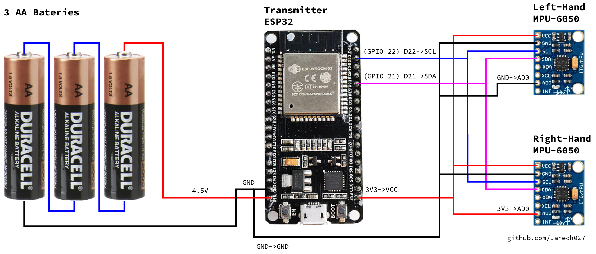

# drone-hands
This repo is dedicated to a project that allows a user to control a drone with their hands as the controller.

# Parts
(2) ESP32 | (2) MPU-6050 - gyroscope/accelerometer | (1) drone/vehicle to control 

# Software
Arduino IDE (For programming ESP32) | LibrePilot (For calibrating drones flight controller)

# Overview
A regular drone usually consists of a couple of main parts that allows the user to control the motors
1) Transmitter (controller)
2) Reciever (translates transmitter data to data that can be read by the flight controller)
3) Flight Controller (sends reciever data to motor and stabalizes drone)

In my case I want my transmitter/controller to be my hands. Meaning when I move my hand upward/downward or side-to-side I want the drone to move with my hands movements.

# How to achieve this
What we need to do is mimic the controllers and reciever. 
This means sending our own data for the Throttle, Roll, Pitch, and Yaw using our hands.

Our hands movement will specifically be them being rotated as if you are using a doorknob for data such as Roll and Yaw, and them being titled up and down as if you are knocking on a door for the Throttle and Pitch.

Throttle  |  Left Hand  | Titled

Yaw       |  Left Hand  | Rotated

Pitch     |  Right Hand | Titled

Roll      |  Right Hand | Rotated

This table above is an overview of which hand (left or right) controls what funciton (throttle, pitch, etc) by which movement (rotation or tilt).

## MPU-6050
To track this data we need something that can track the rotation and tilt of our hands and this is where the MPU-6050 comes in. This device is an Inertial Measurement Unit (IMU) with a built-in 3-axis accelerometer and 3-axis gyroscope, which together measure linear acceleration and angular velocity. To track the throttle and yaw we will put one on our left hand and to track pitch and roll we will place one on our right hand.

## ESP32 - Transmitter
To grab the data from the MPU-6050s and send it to the reciever we will need a micro-contoller that can be programmed to translate this data into the correct format and be able to send it to the reciever. For this job I have chosen the ESP32 as it has a special peer-to-peer communication protocol that uses the 2.4 GHz WiFi band bypassing traditional WiFi. Meaning as long as I have the unique MAC address of the reciever ESP32 I can send it data from the transmitter ESP32.

## ESP32 - Reciever
This ESP32 uses the ESP-NOW data reception to collect the data sent from the transmitter. Once this data is recieved it is translated into PWM (Pulse Width Modulation) by using ESP32's built in capabilities. We are using PWM because this is used to generate a signal for the flight controller. This signal consists of pulses that have different widths which are measured in microseconds. For our case these widths range from 1000 to 2000 microseconds, with 1000 representing the lowest value such as a throttle of 0 and 2000 representing the highest suchas the throttle at full. Once the data is translated it is sent to the flight controller where it can use these signals to control the motors.

# Getting Started
Let's dive into setting up the code and electronics

## Programs
Open your Arduino IDE, and go to your settings/preferences to find the "Additional Board Manager URLs" section, then paste in this link "https://dl.espressif.com/dl/package_esp32_index.json" and press ok.

Now go to the boards manager section and search for "esp32 by Espressif" (I am using version 3.1.0) and press install. 

### Uploading programs to ESP32s
Now we can plug in one of our ESP32s into our computer select its port and define its board as "DOIT ESP32 DEVKIT V1" in the Arduino IDE. After completing these steps we should now be able to upload a program to the ESP32.

Now lets make a new sketch and copy the code included in this repository under "reciever" to your new sketch. Compile this program and install the libraries you are missing. Once the program is able to be compiled press the upload button and this program will now be saved on your ESP32.

If you open the "serial monitor" in the Arduino IDE once the reciever code is uploaded and the ESP32 is still plugged in you can see find the MAC address of the ESP32 which we will need for the transmitter. This will look like "C8:2E:12:21:BC:24" in the serial monitor, once your find it copy and pase this into something you can grab later.

Lets repeat this process for the other ESP32 but now use the code in this repository under "transmitter". The only step that will be different is under the code section that says 
```uint8_t droneMAC[] = {0xC8, 0x2E, 0x12, 0x21, 0xBC, 0x24};``` you will need to replace the numbers with the MAC address of the reciever you saved before.

## Electronics
The Diagram I put together below will show you how to wire the transmitter ESP32




